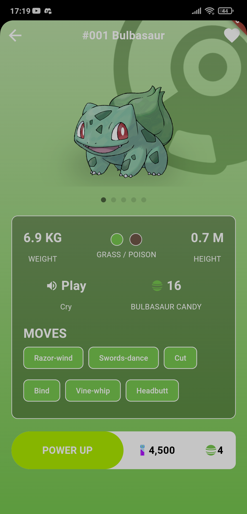
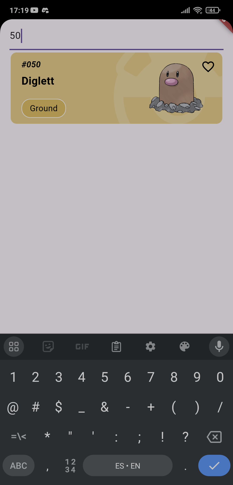
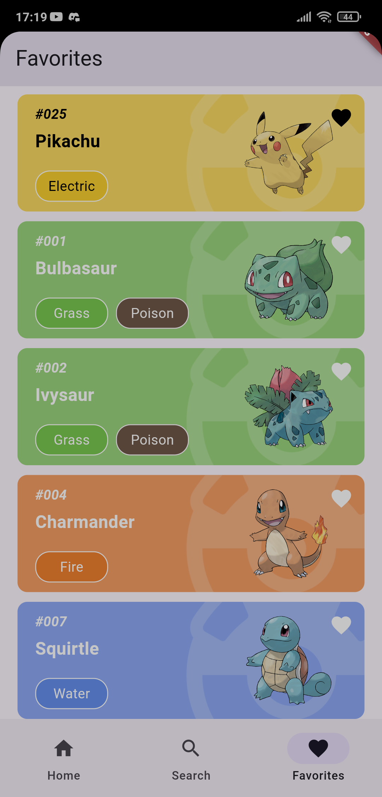
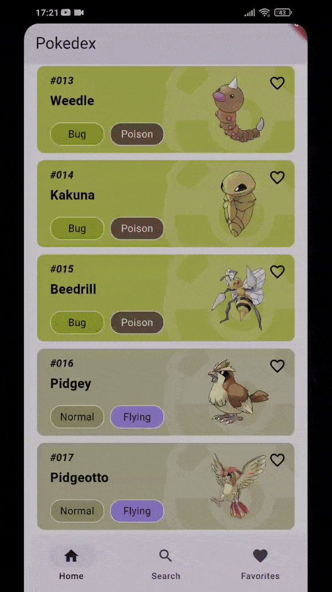

# Fulltimeforce Test

A Flutter project for demonstrating a Pokémon application using PokeAPI.

## Getting Started

### Prerequisites

- Flutter (version 3.0.0 or higher)
- Dart
- Android Studio or Xcode for iOS development

### Installation

1. Clone the repository:
   git clone https://github.com/bryanjorgeflores/fulltimeforce_test.git
   cd fulltimeforce_test

2. Get the dependencies:
   flutter pub get

3. Run the application:
   flutter run

## Technical Decisions

### Packages

- flutter_bloc: Used for state management. It helps in managing the state of the application in a predictable way.
- cached_network_image: Used for efficient image loading and caching.
- sqflite: Used for local database storage.
- path_provider: Used to find commonly used locations on the filesystem.
- dio: Used for making HTTP requests. It provides powerful features like interceptors, global configuration, and more.
- just_audio: Used for playing audio files. It provides a simple API for playing audio from various sources.

### Architectural Patterns

- BLoC (Business Logic Component): Chosen for state management to separate business logic from UI. This makes the code more modular, testable, and reusable.
- Repository Pattern: Used to abstract the data layer, making it easier to manage data from different sources (e.g., network, local database).

### Methodologies

- Clean Architecture: Applied to ensure separation of concerns, making the codebase more maintainable and scalable.

## Additional Functionalities

- Pokémon Search: Allows users to search for Pokémon by name or ID.
- Pokémon Details: Displays detailed information about a selected Pokémon, including its moves, stats, and images.
- Favorites: Users can save their favorite Pokémon locally.
- Pokémon Cry: Users can play the cry sound of a Pokémon.
- Image Gallery: Displays a gallery of images for each Pokémon with a page indicator.

## Screenshots

| Home Screen | Pokémon Details |
|-------------|-----------------|
|  |  |

| Pokémon Search | Favorites |
|----------------|-----------|
|  |  |

## GIFs

| Home Screen | Pokémon Details |
|-------------|-----------------|
|  |  |